# PocketPCAP

PocketPCAP is a local-first, Wireshark-style passive packet capture and first-pass network analysis app for Android 10 and newer. It captures rooted interfaces or local device traffic through Android VPN, opens PCAP/PCAPNG files, and turns tshark evidence into a phone-focused Summary → Packets → Conversations → Endpoints → Protocols → Issues → Objects workflow for analysts and network troubleshooters.

**Package:** `dev.alsatianconsulting.pocketpcap` · **Version:** `0.1.0` · **Min SDK:** 29 · **Bundled engine:** tshark 4.6.8

> Passive diagnostics only. PocketPCAP does not inject, spoof, deauthenticate, craft packets, upload captures, or add telemetry. Decryption uses only keys the user explicitly supplies.

## What It Does

### Mobile analysis workspace

Opening a capture lands on a whole-capture summary with file metadata, duration, packet and byte counts, link type, IPv4/IPv6/MAC counts, dominant protocols, top talkers, conversations, and evidence-backed health findings. Values pivot directly to the supporting packets.

The analysis workspace includes:

- TCP, UDP, IPv4, and IPv6 conversations with directional byte/packet totals, start, duration, stream, sorting, details, Follow Stream, packet filters, endpoint pivots, DNS/TLS/HTTP context, objects, and bookmarks.
- TCP findings for retransmissions, fast retransmissions, duplicate ACKs, out-of-order and lost-segment indicators, zero windows, resets, and repeated failed SYN attempts.
- DNS findings for NXDOMAIN, SERVFAIL, other error responses, unanswered requests, and responses taking at least one second.
- HTTP 4xx/5xx, TLS alerts/old versions/expired certificate evidence when available, malformed packets, ICMP/ICMPv6 errors, and large directional transfers.
- Dedicated DNS transaction, TLS session, and HTTP request/response views with aggregates and packet/stream/endpoint pivots.
- Top senders/receivers, largest conversations, endpoint packet/connection/DNS/retransmission rankings, and protocol/transport distribution.
- Packets/second or bytes/second timeline with event markers and capture-relative range filtering.
- Grouped search across packets, endpoints, conversations, DNS, HTTP, TLS, issues, streams, field names, aliases, packet text, ASCII payloads, and hex byte sequences.
- Capture-scoped packet, endpoint, conversation, stream, issue, DNS, HTTP, and TLS bookmarks with editable analyst notes.
- Contextual filter suggestions derived only from evidence present in the open capture.

Analysis pages are explicitly whole-capture views. Applying a display filter changes the Packets page but does not silently replace whole-capture statistics.

### Packet inspection and filtering

- Full packet list, PDML protocol tree, raw hex/ASCII view, and byte-range highlighting.
- Real Wireshark display filters through tshark, with validation, autocomplete, recent filters, and saved filters.
- Tap-to-filter protocols and endpoint action sheets.
- Field actions: include, exclude, copy name/value, grouped capture search, and up to three live packet-list columns.
- Follow TCP/UDP/TLS/HTTP streams with client/server colors, both/single-direction controls, text/ASCII/hex/HTTP/JSON modes, in-stream search, copy, bookmark, and packet pivot.
- Filtered PCAPNG export and HTTP/TFTP/SMB/IMF/DICOM object extraction.

### Capture modes

- **Root interfaces:** simultaneous capture from one or more Wi-Fi, cellular, loopback, or other interfaces with bundled dumpcap/tshark.
- **Rootless VPN:** device-wide capture through Android's VpnService, with pause/resume and raw-IP PCAPNG output. No root.

### Opening captures made elsewhere

- Open any `.pcap` or `.pcapng` on the device, including one another tool is still writing.
- **Refresh** re-reads the file from its source; **Follow** polls it and reloads whenever it grows, so a capture still being written can be watched as it fills. Built for reading captures produced by AndroidMonitor and ATTA.
- **Merge** two or more captures into one timestamp-ordered file, so captures from different tools on the same device line up on a single timeline.

### Exports

- Filtered PCAPNG, and reconstructed HTTP/TFTP/SMB/IMF/DICOM objects.
- **Headers only** — every packet truncated to 96 bytes, so a capture can be shared for protocol review without disclosing payloads.
- **With packet notes** — analyst notes written into the PCAPNG as native per-packet comments, which Wireshark displays.
- Conversations, Endpoints, Protocols, Issues, DNS, TLS and HTTP as **CSV or JSON**.
- The GeoIP traffic map as **KML or GeoJSON**.

### Resolution and enrichment

- Endpoint aliases and Address / Name / Name + Address display modes.
- Reverse DNS, mDNS, NetBIOS, LLMNR, and IEEE MA-L/MA-M/MA-S vendor resolution.
- Explicit offline GeoIP CSV import plus user-initiated online GeoIP and RDAP/WHOIS lookup.
- GeoIP traffic map with tap-to-filter routes.

### Diagnostics and decryption

- Bluetooth HCI snoop collection/decoding and RIL/modem log capture/parsing.
- TLS key-log and Wi-Fi WPA passphrase decryption using user-provided material.

## How It Does It

PocketPCAP uses Kotlin, Jetpack Compose, Navigation Compose, coroutines, Room, Android `VpnService`, and a bundled AArch64 Wireshark 4.6.8 toolchain. `MainViewModel` owns UI state and background jobs; `CaptureService` owns rooted capture/radio state; `VpnCaptureService` owns the rootless tunnel; and `DecodeManager` is the single gateway to tshark.

The mobile analysis layer runs one tabular tshark fields export for an open capture, then `CaptureAnalysisParser` deterministically correlates packets into metadata, endpoints, conversations, DNS transactions, HTTP transactions, TLS sessions, issues, timeline buckets, and contextual pivots. The immutable result is cached by capture path, size, modification time, decryption arguments, and scope. A new capture or decryption change invalidates it. Payload searching runs on demand so raw payload copies are not retained in the analysis cache.

Every derived entity preserves filters, frame numbers, timestamps, endpoints, and stream numbers where available. Imported capture files are never rewritten. Bookmarks and notes live separately in Room schema v3.

Detailed commands and field dependencies are in [docs/ANALYSIS.md](docs/ANALYSIS.md). Architecture details are in [docs/ARCHITECTURE.md](docs/ARCHITECTURE.md).

## How to Install

### Prerequisites

- Android 10+ ARM64 device.
- Android platform tools (`adb`). On macOS: `brew install android-platform-tools`.
- JDK 17 and Android SDK platform 36 for source builds (Android Gradle Plugin 8.9.3, Gradle 8.11.1).
- Magisk root **only** for live capture from a network interface, Bluetooth HCI collection and radio logs. Opening, decoding and analysing capture files need no root.
- Android VPN approval for rootless capture.

### Recommended Installation

```bash
./gradlew :app:assembleDebug
adb devices -l
adb -s <device-serial> install -r --no-streaming app/build/outputs/apk/debug/*.apk
```

Launch PocketPCAP, refresh **Sources**, approve Magisk if prompted, then open **Files** or choose a mode under **Capture**.

### Manual Installation

The Gradle build performs resource generation, Kotlin/Compose compilation, Room schema export, dependency packaging, bundled-asset packaging, DEX merge, debug signing, and APK naming. To recover those steps manually:

1. Install host tools:

   ```bash
   brew install openjdk@17 android-platform-tools wireshark
   export JAVA_HOME="$(/usr/libexec/java_home -v 17)"
   ```

2. Clone/open the repository and verify `local.properties` points to the Android SDK if Gradle cannot find it:

   ```properties
   sdk.dir=/Users/<name>/Library/Android/sdk
   ```

3. Ensure the bundled runtime assets exist:

   ```text
   app/src/main/jniLibs/arm64-v8a/     tshark, dumpcap and their libraries
   app/src/main/assets/tshark-prefix.zip   Wireshark data files
   app/src/main/assets/manuf.bin
   ```

   All three are git-ignored because of their size. Regenerate them with
   `scripts/build-tshark-bundle.sh` (which produces both the jniLibs and the data
   archive) and `scripts/build-oui.sh`.

4. Remove only cloud-synced duplicate build outputs, then rebuild:

   ```bash
   find app/build -type f -name "* [0-9].*" -delete
   ./gradlew :app:assembleDebug
   ```

5. Install the timestamped APK and launch it:

   ```bash
   adb -s <device-serial> install -r --no-streaming app/build/outputs/apk/debug/PocketPCAP-debug-*.apk
   adb -s <device-serial> shell monkey -p dev.alsatianconsulting.pocketpcap.debug \
     -c android.intent.category.LAUNCHER 1
   ```

6. PocketPCAP writes captures and exports to `Documents/pocketpcap` and creates its object, diagnostic-log, cache, and private tshark directories in app storage on demand. Use **Settings → Storage → Choose folder** to select a different capture directory; Android only permits folders under the standard media directories (`Documents`, `Download`, and so on), and the picker says so if you choose elsewhere.

7. Refresh **Sources** to run the smoke checks. If Magisk recorded a denial, clear PocketPCAP under Magisk → Superuser and retry.

### Files to Edit or Create

- `local.properties`: local Android SDK path; never commit machine-specific contents.
- `app/src/main/assets/tshark-prefix.zip`: bundled runtime generated by the build script.
- `app/src/main/assets/manuf.bin`: offline OUI database.
- TLS key log, Wi-Fi SSID/passphrase, output directory, GeoIP CSV, aliases, and filters are configured in the app; do not hardcode them.
- `keystore.properties`: release signing material — `storeFile`, `storePassword`, `keyAlias`, `keyPassword`. Gitignored, as are `*.jks` and `*.keystore`; never commit either. Without this file the release build falls back to the debug key so the shrunk APK stays installable for testing, which is a development convenience and not publishable.

### Additional Install Modes

```bash
./gradlew :app:assembleRelease          # signed APK  → app/build/outputs/apk/release/
./gradlew :app:bundleRelease            # signed AAB  → app/build/outputs/bundle/release/
adb -s <device-serial> install -r --no-streaming app/build/outputs/apk/release/*.apk
```

Both are signed with the key named by `keystore.properties` when that file is present, and with the debug key when it is not. Verify which you got before distributing anything:

```bash
apksigner verify --print-certs app/build/outputs/apk/release/*.apk
```

Google Play requires the AAB, not the APK.

## How to Use It

1. Open **Files**, tap `+` to open a PCAP/PCAPNG from anywhere on the device, or tap a saved capture.
2. Read **Summary** first, then tap a protocol, talker, or health metric to see its packet evidence.
3. Use **Conversations**, **Endpoints**, **Protocols**, **Issues**, and **Objects** for the primary triage path.
4. Use the top search, timeline, and bookmark actions for contextual analysis.
5. Tap or long-press packet fields and endpoints to build filters and pivots.
6. Long-press a packet or use a conversation/TLS/HTTP action to follow a stream.
7. Export a filtered PCAPNG or extracted object without changing the source capture.

For capture, decryption, and resolver walkthroughs, see the [User Guide](WIKI.md).

## Configuration

Settings cover endpoint resolution/display, local discovery, capture directory, TLS key logs, Wi-Fi keys, offline GeoIP data, aliases, and persistent filters. Capture filters limit recording; display filters limit viewing and remain editable after capture. No API account is required.

Rooted capture has two autostop ceilings, **Stop at size** (default 512 MB) and **Stop after** (default off). dumpcap enforces both itself and closes the PCAPNG cleanly when either is reached, so a capture left running cannot fill the device.

The Android version source of truth is `versionName`/`versionCode` in [app/build.gradle.kts](app/build.gradle.kts). The About card reads generated `BuildConfig.VERSION_NAME` from that source and offers an explicit, user-triggered comparison with the latest `AlsatianConsulting/PocketPCAP` GitHub release.

## Data Storage and Exports

- Captures: `Documents/pocketpcap` by default, or the folder selected in Settings. Reachable from the Files app and over USB, with no special permission — PocketPCAP registers each file with MediaStore, which is what makes a shared folder writable at all. This needs Android 11 or newer; on Android 10 the default stays app external storage `files/captures/`.
- Exports: the same folder, so a capture and everything derived from it stay together — filtered, merged, headers-only, and note-annotated PCAPNG; analysis tables as CSV/JSON; the traffic map as KML/GeoJSON.
- Extracted objects: timestamped per-protocol folders in app external storage, shared individually from the app.
- Captures made before the default moved stay where they are, under app external storage `files/captures/`, and the Files screen lists both locations — nothing is orphaned or migrated behind your back.
- Diagnostic logs: app external storage, preserving raw inputs where practical.
- Aliases, recent/saved filters, bookmarks, and analyst notes: local Room database `pocketpcap.db`.
- Offline GeoIP import and decryption settings: app-local storage/preferences.

If the chosen folder cannot be written — Android refuses any shared folder outside the standard media directories — PocketPCAP falls back to app external storage rather than losing the capture.

Uninstalling the app removes app-scoped storage, and drops PocketPCAP's ownership of what it wrote to `Documents/pocketpcap`. Copy important captures off the device first.

## Screenshots

All screenshots are taken from the running release build on a Pixel 7 (Android 16),
reading a real 496-packet `wlan1` capture. Nothing here is a mock-up.

### Summary first — what is in this capture

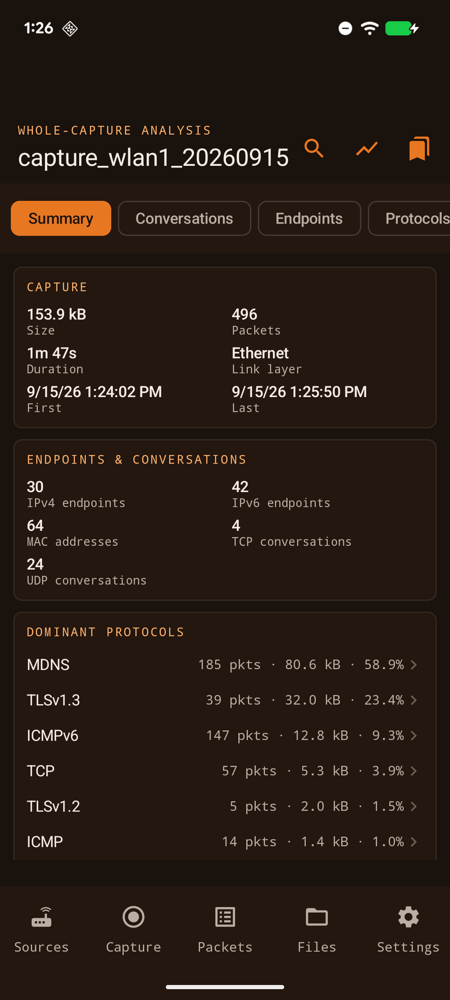

### Issues, with the evidence attached

Every finding names the endpoints, the conversation and the exact packet numbers behind
it, so you can check the claim rather than take it on trust.

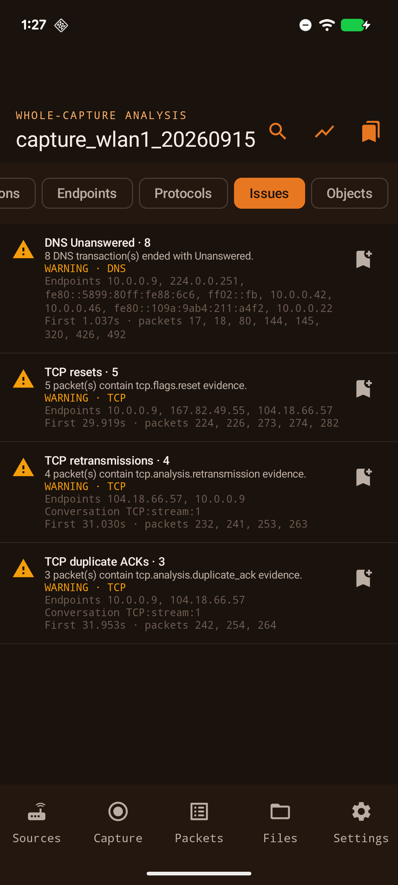

### Timeline

Packets or bytes per time bucket, red markers on buckets containing retransmissions or
resets, and a range control that filters the capture to the window you select.

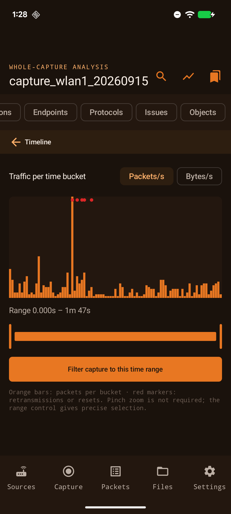

### Conversations and endpoints

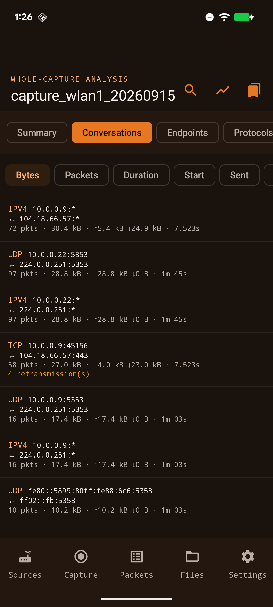
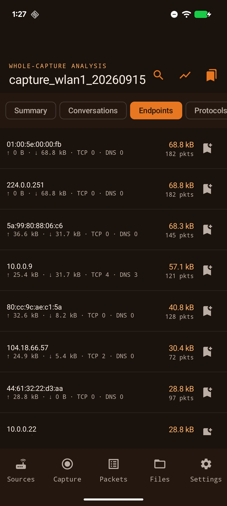

### Protocol hierarchy

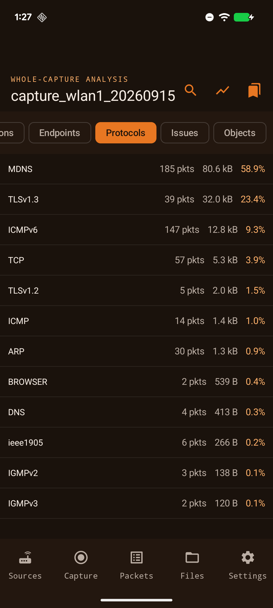

### Packet list and full dissection

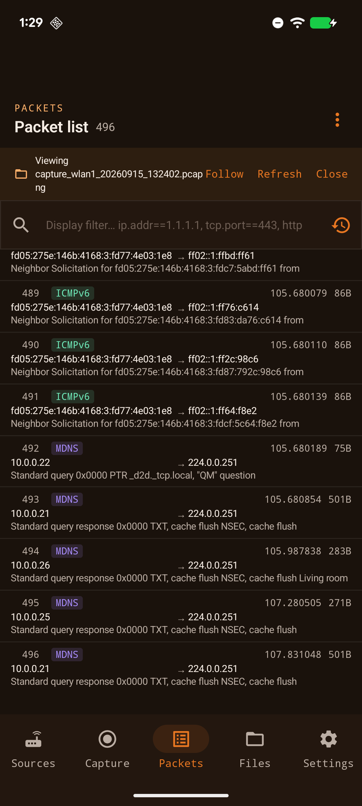
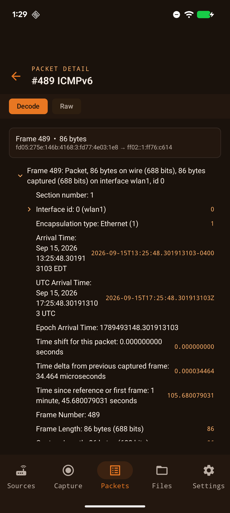

### Capture

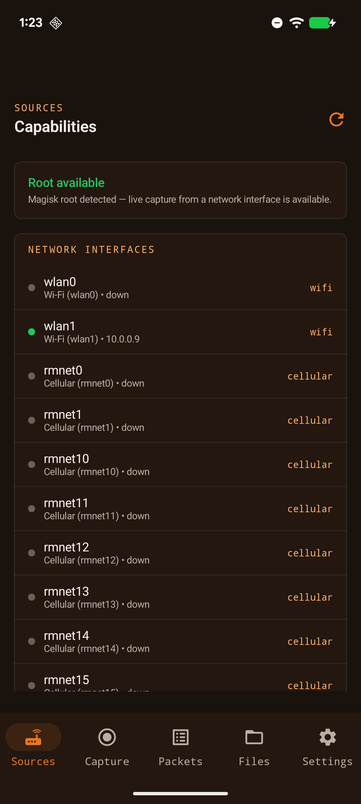
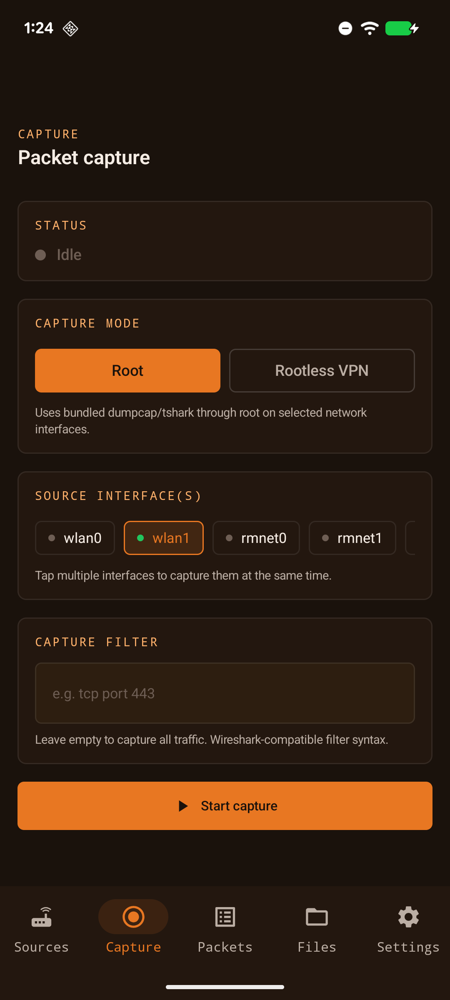
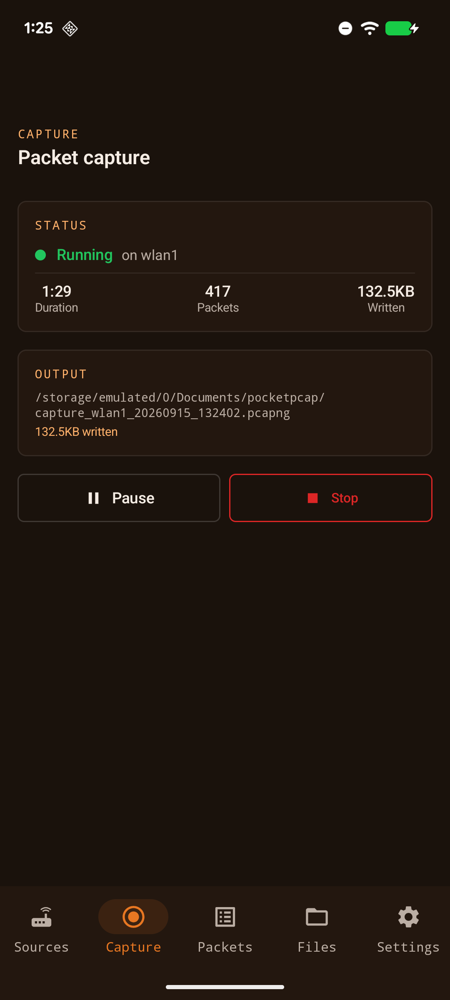
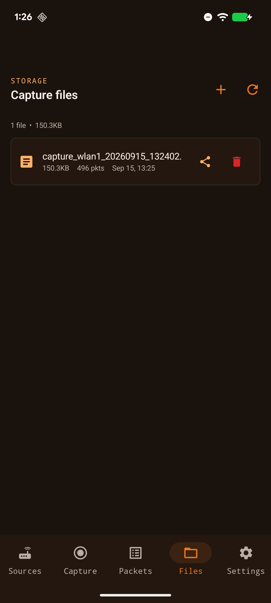

### Settings

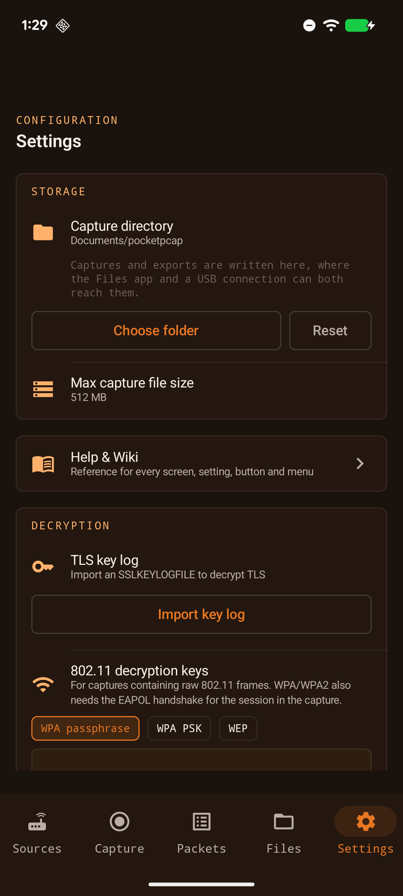

## About

The in-app About card shows:

```text
PocketPCAP
Version 0.1.0

(c) Alsatian Consulting, LLC 2026

GitHub:
https://github.com/AlsatianConsulting

Website:
https://www.alsatian.consulting
```

Its update action reports the current and latest versions and opens the GitHub release page when a newer release exists. It does not download or install releases.

## Troubleshooting

- **`su not found` or decode unavailable:** approve PocketPCAP in Magisk. On Pixel devices Magisk may expose `su` under `/product/bin` or `/system_ext/bin`; PocketPCAP probes both by executing `id`.
- **Duplicate class/resource errors ending in ` 2.dex` or similar:** remove numbered duplicates only under `app/build`, then rebuild with the manual command above.
- **Analysis remains empty:** confirm the file contains packets, root is granted, and the bundled tshark asset extracted. Reopen the file after changing decryption settings.
- **A filter is rejected:** use Wireshark display-filter syntax. The field action menu generates quoted/numeric-safe equality and exclusion expressions.
- **A rooted capture lists no packet count, or sharing it fails:** files written by the root `dumpcap` are handed back to the app on capture stop and when the file list refreshes. If one was left behind by an interrupted capture, reopen the Files tab to reclaim it.
- **Rootless VPN captures no traffic:** approve the VPN dialog and verify allow/exclude app scope. Some apps bypass VPNs or use protected/system networking.
- **Instrumentation DEX merge fails after cloud sync:** run the documented duplicate cleanup before `connectedDebugAndroidTest`.

## Project Layout

```text
app/src/main/java/dev/alsatianconsulting/pocketpcap/
  analysis/     cached analysis models, parser, findings and grouped search
  capture/      rooted/rootless packet recording and PCAPNG writing
  data/         Room entities, DAOs, migrations and repository
  decode/       tshark bundle, decode, decryption and diagnostics
  resolve/      names, OUI, GeoIP and explicit online lookup
  service/      rooted capture and VPN foreground services
  ui/           Compose navigation, screens, components and theme
app/src/test/resources/
  analysis-fixture.pcapng/.tsv and reproducible fixture sources
docs/           architecture, developer, analysis and feature guides
scripts/        tshark/OUI/fixture generation helpers
```

## Known Limitations

- Live capture on a network interface needs root, because dumpcap needs CAP_NET_RAW. Reading, decoding and analysing a capture file need no privileges at all and work on a stock unrooted device.
- TLS payload content is unavailable unless valid user-supplied decryption material matches the capture.
- 802.11 decryption (WEP, WPA/WPA2 passphrase, or raw PSK) applies only to captures containing raw 802.11 frames, and WPA/WPA2 additionally needs the EAPOL four-way handshake for the session to be present. PocketPCAP captures at L3 and cannot record those itself; this is for captures opened from elsewhere, such as a monitor-mode capture taken with an external adapter.
- Following a TLS or HTTP session without a loaded key log shows the underlying TCP byte stream, labelled as such, the same view Wireshark's Follow TCP Stream gives for an encrypted conversation.
- Certificate subject/issuer strings depend on what the dissector exposes; PocketPCAP reports unavailable rather than inferring.
- Self-signed certificates are not flagged unless issuer/subject equality can be established confidently.
- HTTP correlation depends on tshark request/response fields and available decryption/reassembly.
- Analysis is intentionally first-pass mobile triage, not every Wireshark statistics window.
- The packet list holds at most 50,000 rows; a larger capture shows the first 50,000 and says so. Narrow it with a display filter, which is applied by tshark before the ceiling.

See [PRIVACY.md](PRIVACY.md) for the full privacy policy, including exactly what the Traffic Map discloses to third-party lookup services.

## Privacy and Security

Analysis, capture, aliases, notes, GeoIP data, and decryption material stay on-device. PocketPCAP does not upload captures or emit telemetry. Offline GeoIP is preferred. Online GeoIP and RDAP/WHOIS occur only after an explicit endpoint lookup and disclose that endpoint to the selected service. The About update lookup contacts GitHub only when tapped and sends no capture data. Use PocketPCAP only on networks and devices you are authorized to inspect.

## Release Notes

### 0.1.0 (development)

- Added the phone-focused whole-capture Summary and analytical navigation.
- Added conversations, evidence-backed Issues, DNS/TLS/HTTP analysis, statistics, timeline, grouped search, contextual filters, and analyst bookmarks/notes.
- Improved Follow Stream and PDML field actions.
- Added cached single-pass tshark analysis and actual-tshark PCAP regression fixtures.
- Added an explicit About-card release check for the configured production repository.
- Added rootless VPN capture with pause/resume.
- Fixed a first-run crash: the `su` probe's reader thread raised an uncaught `InterruptedIOException` when the probe timed out while the Magisk grant dialog was still open, killing the app and leaving Magisk with a recorded deny.
- Fixed rooted capture files being unreadable by the app: `dumpcap` writes them as root, so they are now chown'd back to the app uid, restoring packet counts, sharing and export.
- Fixed the file-list packet counter, which ignored short `InputStream.skip` returns and undercounted badly (a 597-packet capture reported 48); classic `.pcap` in either byte order is now counted too.
- Fixed pause/stop signalling every `tshark`/`dumpcap` on the device, which could kill or freeze an in-flight analysis; signals are now scoped to the running capture.
- Fixed a crash when stopping a rootless VPN capture: concurrent teardown paths double-closed the SOCKS `ServerSocket` and the tun2socks device fd, tripping fdsan and truncating the pcapng mid-packet.
- Rootless pcapng is now flushed per packet, so the file is a complete, Wireshark-readable capture while recording is still running.
- Fixed packet rows where the address click-to-filter targets, expanded to the 48dp minimum touch target, covered nearly the whole row and made the packet detail view almost unreachable.
- Fixed share/export sheets being denied access to their own `FileProvider` URI.
- Raised `compileSdk`/`targetSdk` to 36 and Android Gradle Plugin to 8.9.3, matching the Android 16 test device.
- Added rooted-capture autostop ceilings for size and duration, enforced by dumpcap.
- Reworked the hex view: the canonical 16-byte row no longer wraps, the offset/hex/ASCII columns stay aligned, and the dump pans horizontally on one shared scroll.
- Bounded the packet list at 50,000 rows and labelled the view when it is truncated.
- The capability list no longer reports tshark decode as available without root; every tshark invocation runs through `su`.
- Refreshed all README screenshots from the running app on a Pixel 7.
- Tested on a stock unrooted Android 16 emulator: no crash, rootless capture and file handling work, and decode now explains that it needs root instead of surfacing `Cannot run program "su"` or claiming "No packets captured yet." for a file whose packets it had just counted.
- The failed `su` probe is now cached, so an unrooted device no longer repeats a ~15 second seven-candidate search on every decode, filter and analysis. A Sources refresh clears it so a device that gains root is picked up without restarting.
- **Decoding and analysis no longer need root.** tshark, dumpcap and their shared libraries now ship as `jniLibs` rather than an assets archive, because Android lets an app execute files from its native library directory but never from its own storage. `scripts/jnilib-name.py` renames each file to the `lib*.so` form the installer extracts and rewrites the matching `DT_SONAME`/`DT_NEEDED` entries so the linkage still resolves. Verified on a stock unrooted Android 16 device: whole-capture analysis, packet list, decode tree and hex view all match the rooted device and host Wireshark exactly.
- Live capture still runs through `su`, and runs a copy of tshark and dumpcap under their real names, because tshark launches dumpcap by looking for that exact filename beside its own binary.
- Removed rootless capture's per-app scoping and the `QUERY_ALL_PACKAGES` permission it needed. The tunnel is now always device-wide apart from PocketPCAP itself. That permission is a Play restricted permission with no use case covering network analysis.
- Removed Qualcomm DIAG, QMDL/DLF import and Wi-Fi monitor mode. Both were root-and-kernel dependent paths that no longer fit an app whose analysis works everywhere.
- **Open any capture file and refresh it while it is still being written.** A file picked from the device is re-read on demand from its source, so captures produced by another tool such as AndroidMonitor or ATTA can be followed as they grow. Use **Refresh** next to the file name on the Packets tab.
- Fixed a crash when opening a picked file: navigation ran from a background thread. Fixed a follow-on crash where the sticky service restart then called `startForeground()` from the background.
- Added 802.11 decryption for WEP, WPA/WPA2 passphrases and raw PSKs, several keys at once. Verified against the Wireshark `wpa-Induction` sample: 802.11 frames decrypt to 18 HTTP transactions, matching desktop tshark exactly.
- Added capture merging, a Follow toggle for captures still being written, headers-only and annotated PCAPNG export, CSV/JSON export of every analysis table, and KML/GeoJSON export of the traffic map.
- Bundled `editcap` and `mergecap` alongside tshark, and the bundle build now fails if any shipped binary has an unresolved shared library.

## License

PocketPCAP is licensed under the **GNU General Public License v3.0 or later**.
See [LICENSE](LICENSE) for the full text.

    Copyright (C) 2026 Alsatian Consulting, LLC

    This program is free software: you can redistribute it and/or modify it
    under the terms of the GNU General Public License as published by the Free
    Software Foundation, either version 3 of the License, or (at your option)
    any later version.

    This program is distributed in the hope that it will be useful, but WITHOUT
    ANY WARRANTY; without even the implied warranty of MERCHANTABILITY or
    FITNESS FOR A PARTICULAR PURPOSE. See the GNU General Public License for
    more details.

    You should have received a copy of the GNU General Public License along
    with this program. If not, see <https://www.gnu.org/licenses/>.

GPL-3.0 is not a preference here, it is the licence the dependencies require.
PocketPCAP links tun2socks (GPL-3.0-only) into its own process for rootless VPN
capture, and ships Wireshark (GPL-2.0-or-later) inside the APK. Every bundled
component, its version and its licence are listed in
[THIRD-PARTY-NOTICES.md](THIRD-PARTY-NOTICES.md), together with the written offer
for corresponding source.

© Alsatian Consulting, LLC 2026.
